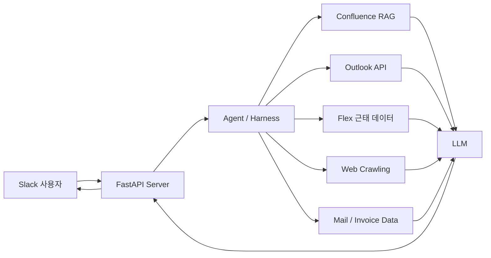

# ConnBot

> 사내 정보 탐색과 반복 업무를 자동화하기 위한 **업무형 AI Agent**

ConnBot은 스타트업 **Connecteve**의 사내 업무 환경을 대상으로 개발한 AI Agent입니다.  
Confluence 문서 검색, 정부지원사업 및 뉴스 브리핑, Outlook 회의실 예약, 근태 조회, 인보이스 종합 등 여러 업무 도구를 하나의 Slack 기반 챗봇에서 사용할 수 있도록 구성했습니다.

---

## 1. 프로젝트 소개

사내 구성원은 업무 중 다음과 같은 정보를 반복적으로 탐색해야 했습니다.

- 사내 규정 및 업무 문서 검색
- 정부지원사업 공고 확인
- 회사 관련 뉴스 탐색
- 근태 현황 조회
- 회의 일정 및 회의실 확인
- 인보이스와 운영 자료 취합

기존에는 각 서비스에 직접 접속해 정보를 찾거나 수작업으로 자료를 정리해야 했습니다.  
ConnBot은 이러한 과정을 **대화형 인터페이스와 자동화 도구**로 통합하여 정보 접근성과 업무 생산성을 높이는 것을 목표로 합니다.


---

## 2. 주요 기능

### 2.1 사내 문서 기반 검색 및 답변 생성

Confluence 문서를 수집하고 전처리하여 RAG 검색 환경을 구축했습니다.

사용자의 질문과 관련된 사내 문서를 검색한 뒤, LLM이 검색 결과를 기반으로 답변을 생성합니다. 답변에는 근거가 된 문서 출처를 함께 제공하여 신뢰성과 검증 가능성을 높였습니다.

**주요 처리 흐름**

```text
사용자 질문
    ↓
질문 분석
    ↓
Confluence 문서 검색
    ↓
관련 문서 재정렬 및 컨텍스트 구성
    ↓
LLM 답변 생성
    ↓
답변과 출처 제공
```


---

### 2.2 정부과제·뉴스·근태 자동 브리핑 및 대화 기능

정부지원사업 공고, 주요 뉴스, 근태 현황을 정해진 시간에 자동으로 수집하고 요약합니다.

정기 브리핑 이후에는 사용자가 챗봇을 통해 특정 공고, 기사 또는 근태 정보를 추가로 검색할 수 있도록 구현했습니다.

**제공 정보**

- 정부지원사업 및 정부과제 공고
- 회사 및 산업 관련 주요 뉴스
- 구성원 근태 현황
- 브리핑 이후 추가 질의응답


---

### 2.3 회의실 조회 및 예약 관리

Outlook API를 연동하여 사용자가 Slack에서 회의 일정과 회의실 상태를 확인할 수 있도록 구현했습니다.

조회 결과를 기반으로 가능한 시간대를 확인하고, 필요한 경우 회의 예약까지 처리할 수 있습니다.

**주요 기능**

- 개인 및 팀 일정 조회
- 회의실 사용 가능 여부 확인
- 일정 충돌 확인
- 회의 및 회의실 예약
- 예약 정보 확인


---

### 2.4 인보이스 및 운영 자료 종합

이메일과 첨부파일에 분산된 AI 서비스 구독 인보이스 및 운영팀 자료를 수집하여 한 번에 확인할 수 있도록 구현했습니다.

**활용 예시**

- 서비스별 인보이스 검색
- 결제 내역 및 청구 정보 정리
- 첨부파일 기반 데이터 추출
- 운영 자료 통합 조회


---

## 3. 기술 구성

| 구분 | 적용 기술 및 역할 |
|---|---|
| 사용자 인터페이스 | Slack App |
| API 서버 | FastAPI |
| 사내 문서 검색 | Confluence 기반 RAG |
| 일정 및 회의실 | Outlook API |
| 외부 정보 수집 | Web Crawling |
| 근태 정보 | Flex 데이터 연동 및 수집 |
| 답변 생성 | LLM |
| Agent 제어 | Prompt Engineering, Tool Calling, Harness Engineering |

---

## 4. 시스템 구조

ConnBot은 사용자의 요청을 분석한 뒤 적절한 도구를 선택하고, 도구 실행 결과를 LLM이 최종 답변으로 구성하는 형태로 동작합니다.



> **이미지 삽입 위치 — 전체 시스템 아키텍처**  
> 권장 경로: `docs/images/07-system-architecture.png`
